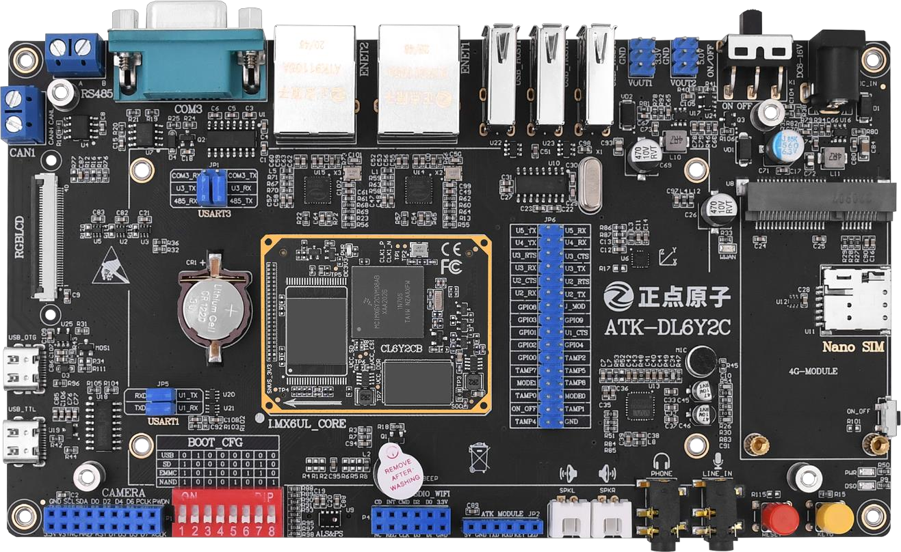

# i.MX6ULL_GreenHouse
## 1. Overview

基于 **i.MX6ULL** 嵌入式平台搭建的智能温室环境监测与控制系统。系统通过 I2C/SPI 总线接入多类环境传感器，实时采集温度、湿度、光照强度、二氧化碳浓度等参数，并在本地 Qt 图形界面上以图表形式展示。

用户可通过界面远程控制通风、灌溉、补光等执行设备，实现环境参数的闭环监测与调节。项目涵盖 U-Boot 启动配置、BusyBox 根文件系统构建、Linux 字符设备驱动开发（Device Tree + ioctl 用户态接口），以及 Qt 上位机应用的联调与部署。

## 2. 视频演示
<video src="https://github.com/user-attachments/assets/05c5bad7-1e2a-4148-a8ab-4c3bb120cad6" controls width="600"></video>

## 3. 开发环境

  

正点原子阿尔法开发板(Emmc 版本)+7 寸 RGB 屏幕， 除此之
所用传感器及其链接如下：

1. AHT20 温湿度传感器：[链接](https://detail.tmall.com/item.htm?id=875278011143&mi_id=0000ZwoEB9k8XuHeKRl3EkOlDrltHBpUC0UdB3XgYcqVTCo&spm=tbpc.boughtlist.suborder_itemtitle.1.c66b2e8dpq4jyY)
2. 二氧化碳传感器 SGP30 ：[链接](https://detail.tmall.com/item.htm?id=604536932829&mi_id=0000-Y02bgqcLrWDOztExoTw3zM44NqlCbPW5lR9wd3lfbA&spm=tbpc.boughtlist.suborder_itemtitle.1.c66b2e8dpq4jyY)
3. 光照传感器：i.MX6ULL板载 `AP3216c`
4. 土壤湿度：[链接](https://detail.tmall.com/item.htm?id=875426946850&mi_id=0000pkiDG64U0nLeGddM3u0lJ6gRRAtnLZuyn0HC_iRz4J0&spm=tbpc.boughtlist.suborder_itemtitle.1.c66b2e8dpq4jyY)
5. 风扇：[链接](https://detail.tmall.com/item.htm?id=875284199184&mi_id=0000GGT7NGVTK5wwYs6wgUoi63vLUmvJkip76MYnWpSc4HU&spm=tbpc.boughtlist.suborder_itemtitle.1.c66b2e8dpq4jyY)
6. 灌溉设备：[链接](https://item.taobao.com/item.htm?id=649560720007&mi_id=0000VFIV71QTyuyEatriA3hNOzzdP4bbxYivvD40LHgKOD8&skuId=5255327324374&spm=tbpc.boughtlist.suborder_itemtitle.1.c66b2e8dpq4jyY)
# test_push_260706
