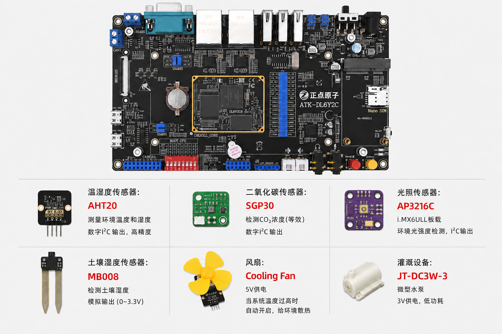

# i.MX6ULL_GreenHouse
## 1. Overview

基于 **i.MX6ULL** 嵌入式平台搭建的智能温室环境监测与控制系统。系统通过 I2C/SPI 总线接入多类环境传感器，实时采集温度、湿度、光照强度、二氧化碳浓度等参数，并在本地 Qt 图形界面上以图表形式展示。

用户可通过界面远程控制通风、灌溉、补光等执行设备，实现环境参数的闭环监测与调节。项目涵盖 U-Boot 启动配置、BusyBox 根文件系统构建、Linux 字符设备驱动开发，以及 Qt 上位机应用的联调与部署。

## 2. 视频演示
<video src="https://github.com/user-attachments/assets/05c5bad7-1e2a-4148-a8ab-4c3bb120cad6" controls width="600"></video>

## 3. 开发环境
<div align="center">
  
</div>
本项目采用正点原子阿尔法开发板(Emmc 版本)+4.3 寸 RGB 屏幕， 所用传感器及其链接如下：

1. AHT20 温湿度传感器：[链接](https://detail.tmall.com/item.htm?id=875278011143&mi_id=0000ZwoEB9k8XuHeKRl3EkOlDrltHBpUC0UdB3XgYcqVTCo&spm=tbpc.boughtlist.suborder_itemtitle.1.c66b2e8dpq4jyY)
2. 二氧化碳传感器 SGP30 ：[链接](https://detail.tmall.com/item.htm?id=604536932829&mi_id=0000-Y02bgqcLrWDOztExoTw3zM44NqlCbPW5lR9wd3lfbA&spm=tbpc.boughtlist.suborder_itemtitle.1.c66b2e8dpq4jyY)
3. 光照传感器：i.MX6ULL板载 `AP3216c`
4. 土壤湿度：[链接](https://detail.tmall.com/item.htm?id=875426946850&mi_id=0000pkiDG64U0nLeGddM3u0lJ6gRRAtnLZuyn0HC_iRz4J0&spm=tbpc.boughtlist.suborder_itemtitle.1.c66b2e8dpq4jyY) ，土壤温度：板载 `icm20608`
5. 风扇：[链接](https://detail.tmall.com/item.htm?id=875284199184&mi_id=0000GGT7NGVTK5wwYs6wgUoi63vLUmvJkip76MYnWpSc4HU&spm=tbpc.boughtlist.suborder_itemtitle.1.c66b2e8dpq4jyY)
6. 灌溉设备：[链接](https://item.taobao.com/item.htm?id=649560720007&mi_id=0000VFIV71QTyuyEatriA3hNOzzdP4bbxYivvD40LHgKOD8&skuId=5255327324374&spm=tbpc.boughtlist.suborder_itemtitle.1.c66b2e8dpq4jyY)

| 参数 | Value |
| --- | --- |
| 芯片 | i.MX6ULL（MCIMX6Y2CVM08AB） |
| 处理器 | 单核 Cortex-A7 @ 800MHz |
| 内存 | 512MB DDR3L |
| 存储介质 | 8GB eMMC / TF 卡 |
| 以太网 | 双路 10/100M |
| 屏幕接口 | RGB888 + 触摸 I2C：GT9147 |
| 屏幕型号 | ATK4384(800*480) |

- 虚拟机版本：`Ubuntu 16.04.7 LTS`
- 交叉编译器：`arm-linux-gnueabihf-gcc (Linaro GCC 4.9-2017.01) 4.9.4`

## 4. 仓库目录说明

```text
i.MX6ULL_GreenHouse/
├── README.md                      # 项目说明
├── demo.mp4                       # 演示视频
├── pic/                           # README 配图
├── uboot/                         # U-Boot 源码（启动引导）
│   ├── configs/                   # 板级 defconfig
│   ├── mx6ull_alientek_emmc.sh    # 阿尔法 eMMC 编译脚本
│   └── ...
├── linux-source/                  # Linux 内核源码
│   ├── arch/arm/boot/dts/         # 设备树（i.MX6ULL）
│   ├── drivers/                   # 驱动（含传感器字符设备等）
│   ├── .config                    # 内核配置
│   └── ...
├── QtSource_GreenHouse_Host/      # Qt 上位机 / 界面应用
└── GreenHouse_rootfs/             # 根文件       
```
## 5. U-Boot移植
1. 先编译u-boot
```bash
cd uboot
touch mx6ull_alientek_emmc.sh       # 新建一个编译脚本
chmod 777 mx6ull_alientek_emmc.sh   # 给予可执行权限
source mx6ull_alientek_emmc.sh      # 编译 uboot
```
2. 烧写到 SD 卡中
  编译完成以后使用 [imxdownload](uboot/imxdownload) 将新编译出来的 `u-boot.bin` 烧写到 SD 卡中

3. 网络启动Linux
  在 mobaxterm 中设置 **bootargs** 和 **bootcmd** 这两个环境变量：
  ```shell
  setenv bootargs 'console=ttymxc0,115200 root=/dev/mmcblk1p2 rootwait rw'
  setenv bootcmd 'tftp 80800000 zImage; tftp 83000000 imx6ull-alientek-emmc.dtb; bootz 80800000 - 83000000'
  saveenv
  ```
  |bootargs参数|含义||bootcmd参数|含义|
  |-|-|-|-|-|
  |console|设置 linux 终端||tftp|下载文件到内存|
  |root|设置根文件系统的位置||bootz|启动 zImage 格式的 Linux 内核|
  |rootwait|等待 mmc 设备初始化完成以后再挂载||80800000|内核镜像(zImage)加载到 DRAM 的地址|
  |rw|文件系统可读写||83000000|设备树加载到 DRAM 的地址|

4. U-Boot 网络启动流程
  ```mermaid
  flowchart LR
      A[上电复位] --> B[BootROM 加载 U-Boot]
      B --> C[U-Boot 初始化<br/>时钟 / DDR / 串口 / 网卡]
      C --> D[读取环境变量<br/>bootargs / bootcmd]
      D --> E[执行 bootcmd]
      E --> F[tftp 80800000 zImage<br/>下载内核到 DRAM]
      E --> G[tftp 83000000 *.dtb<br/>下载设备树到 DRAM]
      F --> H[bootz 80800000 - 83000000<br/>跳转启动内核]
      G --> H
      H --> I[Linux 内核启动]
      I --> J[按 bootargs 挂载根文件系统<br/>root=/dev/mmcblk1p2 rw]
      J --> K[进入用户空间 / 启动应用]
  ```

## 6. ⚙️驱动源码路径
```bash
cd linux-source                         # 驱动路径都在 linux-source/ 下
# 编译驱动模块：
cd drivers/media/i2c/Green_House/xxx    # 进入驱动目录下
make                                    # 编译模块
```
1. AHT20 温湿度传感器
  - 路径：[drivers/media/i2c/Green_House/aht20](linux-source/drivers/media/i2c/Green_House/aht20/aht20.c)

2. SGP30 二氧化碳传感器
  - 路径：[drivers/media/i2c/Green_House/sgp30](linux-source/drivers/media/i2c/Green_House/sgp30/sgp30.c)

3. AP3216c 光照传感器
  - 路径：[drivers/media/i2c/Green_House/ap3216c](linux-source/drivers/media/i2c/Green_House/ap3216c/ap3216c.c)

4. MB008 土壤湿度
  - 路径：[drivers/iio/adc/vf610_adc.c](linux-source/drivers/iio/adc/vf610_adc.c)
  > 内核写好的驱动，无需单独编译成ko文件

5. ICM20608 六轴 MEMS 传感器(只用到了内波包含的温度传感器)
  - 路径：[drivers/media/spi/icm20608](linux-source/drivers/media/spi/icm20608/icm20608.c)

6. 风扇
  - 路径：[drivers/platform/Green_House/fan](linux-source/drivers/platform/Green_House/fan/fan.c)

7. 灌溉设备
  - 路径：[drivers/platform/Green_House/irr](linux-source/drivers/platform/Green_House/irr/irr.c)

### 🌿dts路径：[arch/arm/boot/dts/imx6ull-14x14-evk.dts](linux-source/arch/arm/boot/dts/imx6ull-14x14-evk.dts)